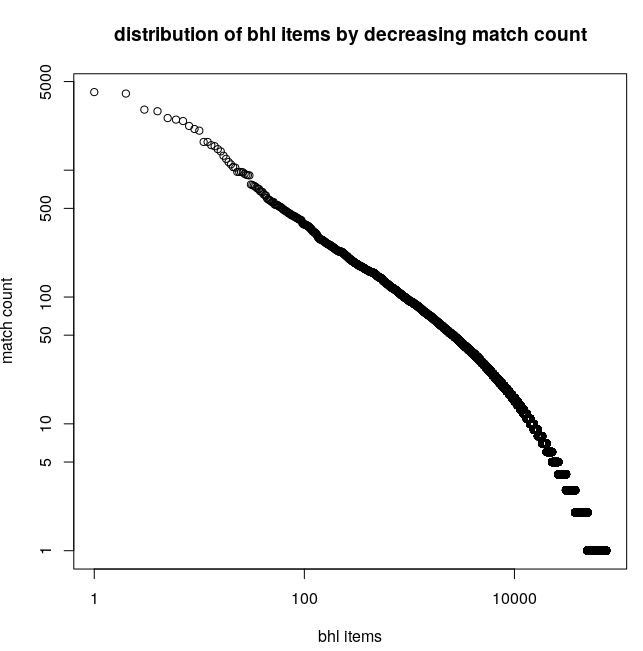

This page describes a method on how to find items with keys on BHL.

# methods

## Use cases

To help develop a computational method to help detect occurrences of identification keys in biodiversity texts, a librarian, a biologist articulate the three use cases. The use cases inform envised detection and usage of identification keys in biodiversity texts.

(include use cases)

## method for detecting identification keys

After articulating the use cases, the following method was developed to iteratively improve an algorithm to detect likely identification keys in biodiversity texts:

1. get all the BHL data/ corpus
2. find lines containing likely identification keys in the corpus
3. save results in a file with (at least) three columns: (1) Extracted matching line with "key" occurrence and (2) item id (3) line number of "key" occurrence
4. Domain expert visually inspects matching lines for false positives
5. When needed, the expert reviews the original text containing the matching line
6. Refine regular expression to work around false positives, go to 


# results 

## aqcuisition of BHL corpus

The BHL corpus was accessed via a Preston BHL archive. The archive used consisted of two versioned snapshots of the BHL corpus obtained over the period of period May-June 2019. Each snapshot contains item ocr texts as well as a detailed record from which url the ocr texts were obtained and when. Each obtained ocr text is identified by its content hash. A content hash is an algorithmically generated unique identifier based on, and only on, the content of the ocr text. In case of Preston, sha256 content hashes are used (see https://preston.guoda.bio). This detailed information help to establish a link between the content that was present at a specific time to a BHL item identifier. By using the Preston BHL archive, we can link ocr text to its bhl item identifier in addition to uniquely identifying what ocr text was used. In addition to this, the archive contains a record of missing ocr texts, or ocr texts that were unable to be accessed at the expected location in the internet archive.  

The BHL archive was accessed using an external harddisk to optimize data retrieval. This archive was retrieved from a remote server location (e.g., https://deeplinker.bio) using rsync (add reference) prior to the workshop. The BHL archive total size was 120GB and consisted of XX ocr texts and a single tabular file containing the BHL item catalog. The item catalog is update weekly (Pers. Comm. Mike / Joel from EOL) and contains all items in BHL. 

### completeness

To assess the completeness of the used BHL corpus, the available ocr texts were linked to the BHL item catalog. This showed that out of 285k items, 57k items, or 20%, were missing ocr texts. The top 10 urls that failed to serve ocr texts for items were:

```shell
$ cat bhl_djvu_404.tsv | head
https://archive.org/download/00921238.85096.emory.edu/00921238.85096.emory.edu_djvu.txt
https://archive.org/download/02145706.5485.emory.edu/02145706.5485.emory.edu_djvu.txt
https://archive.org/download/0220434.nlm.nih.gov/0220434.nlm.nih.gov_djvu.txt
https://archive.org/download/03060843.1594.emory.edu/03060843.1594.emory.edu_djvu.txt
https://archive.org/download/03060843.1595.emory.edu/03060843.1595.emory.edu_djvu.txt
https://archive.org/download/03060843.1596.emory.edu/03060843.1596.emory.edu_djvu.txt
https://archive.org/download/03060843.1597.emory.edu/03060843.1597.emory.edu_djvu.txt
https://archive.org/download/03060843.1598.emory.edu/03060843.1598.emory.edu_djvu.txt
https://archive.org/download/03060843.1599.emory.edu/03060843.1599.emory.edu_djvu.txt
https://archive.org/download/03060843.1600.emory.edu/03060843.1600.emory.edu_djvu.txt
```

The full list of broken urls links can be found at [bhl_djvu_404.tsv](./bhl_djvu_404.tsv).

### detecting identification keys

After acquiring the BHL corpus and establishing that our BHL corpus contained about 80% of the available ocr texts, a bash script, [find_keys.sh](./find_keys.sh) was created to match all lines in ocr text against a regular expression. The script takes two arguments (1) the location of the BHL corpus and (2) a regular expression for matching likely keys.

The script was executed using the BHL corpus on an external hardisk attached to a dual core lenovo T430 laptop with 8GB of memory using regular expression using regular expression ```\bkey\b```. It took about 50 minutes for the script to match all the lines of the ocr text. The output of the script captured the line number, text, content hash and related BHL, internet archive and Preston urls in the file [itemurl-line-match.tsv](./itemurl-line-match.tsv.gz). The file contains 758k unique matches, including the 10 lines below. Note that the urls were turned into labels ia (internet archive), bhl (biodiversity heritage library) and ocr test (a url pointing to a preston archive at https://deeplinker.bio) to declutter the table representation.

 bhl item links | line number | matching line
  --- | --- | ---
[ia]([ia](https://archive.org/download/00921238.85096.emory.edu) [bhl](https://www.biodiversitylibrary.org/item/174408) [ocr text](https://deeplinker/80a66488fa27d4f5c2ed03914220c5f749d2469c5f7264ab7c08dc94ee8b6fc7) |10867|belong we have the key-note to the common 
[ia](https://archive.org/download/00921238.85096.emory.edu) [bhl](https://www.biodiversitylibrary.org/item/174408) [ocr text](https://deeplinker/80a66488fa27d4f5c2ed03914220c5f749d2469c5f7264ab7c08dc94ee8b6fc7)|11012|living beings, it gave him the key to many mys- 
[ia](https://archive.org/download/00921238.85096.emory.edu) [bhl](https://www.biodiversitylibrary.org/item/174408) [ocr text](https://deeplinker/80a66488fa27d4f5c2ed03914220c5f749d2469c5f7264ab7c08dc94ee8b6fc7)|12431|common Five-Finger (Asterias) gives the key to 
[ia](https://archive.org/download/00921238.85096.emory.edu) [bhl](https://www.biodiversitylibrary.org/item/174408) [ocr text](https://deeplinker/80a66488fa27d4f5c2ed03914220c5f749d2469c5f7264ab7c08dc94ee8b6fc7)|2616|and is the key to their whole organization. A 
[ia](https://archive.org/download/00921238.85096.emory.edu) [bhl](https://www.biodiversitylibrary.org/item/174408) [ocr text](https://deeplinker/80a66488fa27d4f5c2ed03914220c5f749d2469c5f7264ab7c08dc94ee8b6fc7)|3049|fications ; and that we have already the key by 
[ia](https://archive.org/download/00921238.85096.emory.edu) [bhl](https://www.biodiversitylibrary.org/item/174408) [ocr text](https://deeplinker/80a66488fa27d4f5c2ed03914220c5f749d2469c5f7264ab7c08dc94ee8b6fc7)|513|whole. It was Cuvier who found the key. He 
[ia](https://archive.org/download/00921238.85096.emory.edu) [bhl](https://www.biodiversitylibrary.org/item/174408) [ocr text](https://deeplinker/80a66488fa27d4f5c2ed03914220c5f749d2469c5f7264ab7c08dc94ee8b6fc7)|5306|pitched on a different key, it is true, but a sound 
[ia](https://archive.org/download/00921238.85096.emory.edu) [bhl](https://www.biodiversitylibrary.org/item/174408) [ocr text](https://deeplinker/80a66488fa27d4f5c2ed03914220c5f749d2469c5f7264ab7c08dc94ee8b6fc7)|673|and gave us the key-note to the natural affinities 
[ia](https://archive.org/download/00921238.85096.emory.edu) [bhl](https://www.biodiversitylibrary.org/item/174408) [ocr text](https://deeplinker/80a66488fa27d4f5c2ed03914220c5f749d2469c5f7264ab7c08dc94ee8b6fc7)|7270|crescent, from Virginia Key and Key Biscayne, 
[ia](https://archive.org/download/00921238.85096.emory.edu) [bhl](https://www.biodiversitylibrary.org/item/174408) [ocr text](https://deeplinker/80a66488fa27d4f5c2ed03914220c5f749d2469c5f7264ab7c08dc94ee8b6fc7)|7271|almost adjoining the main-land, to Key West, at 
[ia](https://archive.org/download/00921238.85096.emory.edu) [bhl](https://www.biodiversitylibrary.org/item/174408) [ocr text](https://deeplinker/80a66488fa27d4f5c2ed03914220c5f749d2469c5f7264ab7c08dc94ee8b6fc7)|7490|light-house, built on Sand Key for the greater 

Some further analysis conveyed that 75k items (32% of items with ocr text) has one or more matches to ```\bkey\b```. Also, the graph shows that there are few items with many counts (i.e., about 100 items with 500 matches or more) and many items with few count (i.e., about 65k items with 10 matches or less). More analysis is needed to indicate whether number of match counts is a way to detect likely identification key in BHL items.

[]

For more details on the results, please refer to appendix A. This appendix contains code snippets and result logs that help to reproduce the results provided that the same version of the BHL archive is used. If you decide to do that, you can algorithmically verify that the same Preston BHL archive is used.

## Discussion 

Observations
1. Librarian and biologist need to do many fast iterations to refine the key matching algorithms
1. Software engineers need time to develop tools.
1. a bash script produced different results depending on operating system (mac vs linux).

Open questions/ideas:

1. Can you link to a BHL page and jump to a specific line number in the OCR text?
1. What tools are available to visually annotate and select texts that describe a Key?
1. Which software libraries or platforms can help with text classification (e.g., does this text contain a key?) and segmentation (e.g., which part of the text is a key)? (Stanford CoreNLP, OpenNLP)

## Appendix A

This appendix contains logs and code snippets to help reproduce the results.

The listing below contains the log of the execution of the [find_keys.sh](./find_keys.sh) scripts.

```shell
$ time ./find_keys.sh /media/jorrit/cobaltblue/preston-bhl/ "\bkey\b"
+ OLD_PWD=/home/jorrit/proj/gn-hackathon/Identification-Key-Finder
+ DATA_DIR=/media/jorrit/cobaltblue/preston-bhl/
+ REGEX='\bkey\b'
+ cd /media/jorrit/cobaltblue/preston-bhl/
+ echo 'Scanning BHL corpus for matches to regular expression'
Scanning BHL corpus for matches to regular expression
+ echo 'output to /home/jorrit/proj/gn-hackathon/Identification-Key-Finder/hash-line-match.tsv'
output to /home/jorrit/proj/gn-hackathon/Identification-Key-Finder/hash-line-match.tsv
+ find data -type f
+ xargs grep -n '\bkey\b' -w -i
+ sed -e 's+^.*/../../++'
+ sed -e 's/:/\t/'
+ sed -e 's/:/\t/'
+ cat /home/jorrit/proj/gn-hackathon/Identification-Key-Finder/hash-line-match-unsorted.tsv
+ sort
+ echo 'Obtaining map from file hash to file barcode'
Obtaining map from file hash to file barcode
+ preston log -l tsv
+ cat /home/jorrit/proj/gn-hackathon/Identification-Key-Finder/log.tsv
+ grep 'archive.*hasVersion'
+ grep -v well-known
+ sed -e 's+[ia](https://archive.org/download/\([^/]*\).*sha256/\(.*\)+\2\t\1+'
+ sort
+ echo 'Obtaining map from barcode to BHL item'
Obtaining map from barcode to BHL item
+ cat /home/jorrit/proj/gn-hackathon/Identification-Key-Finder/log.tsv
+ head -n100
+ head -n 1
+ grep hasVersion
+ grep item.txt
+ tail -n +2
+ sort
+ cut -f8,4
+ cut -f 3
+ preston get
+ echo 'Joining on file hash and sorting'
Joining on file hash and sorting
+ join --nocheck-order -t '	' -1 1 -2 1 /home/jorrit/proj/gn-hackathon/Identification-Key-Finder/hash-barcode.tsv /home/jorrit/proj/gn-hackathon/Identification-Key-Finder/hash-line-match.tsv
+ sort -k 2
+ echo 'Joining on barcode and sorting'
Joining on barcode and sorting
+ join --nocheck-order -t '	' -1 1 -2 2 /home/jorrit/proj/gn-hackathon/Identification-Key-Finder/barcode-itemurl.tsv /home/jorrit/proj/gn-hackathon/Identification-Key-Finder/barcode-line-match.tsv
+ sed -e 's+\(.*\)\t\(.*\)\t\(.*\)\t\(.*\)\t\(.*\)+[ia](https://archive.org/download/\1\t\2\t[ocr text](https://deeplinker/\3\t\4\t\5+'

real	46m36.495s
user	9m22.076s
sys	3m57.117s
```

### result stats

Counting unique number of line matches again BHL corpus using regex ```\bkey\b```.

```shell
$ zcat itemurl-line-match.tsv.gz | sort | uniq | wc -l```)
758180
```

Calculating the number of unique BHL items with matches. 

```shell 
$ zcat itemurl-line-match.tsv.gz | sort | uniq | cut -f2 | sort | uniq | wc -l```)
74719
```

Calculating the top 10 BHL items with most number of matches.
```shell 
$ zcat itemurl-line-match.tsv.gz | sort | uniq | cut -f2 | sort | uniq -c | sort -nr \
    | sed "s/^[^0-9]*//g" | tr ' ' '\t' \
    > matches-per-item-sorted-descending.tsv
$ head matches-per-item-sorted-descending.tsv
4127	https://www.biodiversitylibrary.org/item/107146
4020	https://www.biodiversitylibrary.org/item/118981
3002	https://www.biodiversitylibrary.org/item/262128
2916	https://www.biodiversitylibrary.org/item/107123
2576	https://www.biodiversitylibrary.org/item/107124
2505	https://www.biodiversitylibrary.org/item/194866
2440	https://www.biodiversitylibrary.org/item/261069
2231	https://www.biodiversitylibrary.org/item/194618
2111	https://www.biodiversitylibrary.org/item/107164
2049	https://www.biodiversitylibrary.org/item/29885
```

Constructing a figure with a distribution of number of matches across BHL items with at least one match using R (see https://r-project.org ).

```R
plot(item_matches$count, log="xy")
item_matches <- read.csv('matches-per-item-sorted-descending.tsv', header=F, sep='\t')
names(item_matches) <- c('count', 'item_url')
plot(item_matches$count, log="xy", xlab='bhl items', ylab='match count', main='distribution of bhl items by decreasing match count')
```
The R script above was used to produce the plot below. 

[]

### system info
A Ubuntu Linux 18.04 operating was used, running on Lenovo Laptop T430 8GB RAM with dual core Intel(R) Core(TM) i5-3320M CPU @ 2.60GHz.

### BHL Corpus 


Calculate number of items in the BHL catalogue:
```
$ cat item.txt | wc -l
242511
```
Note that the file item.txt was extracted from the Preston BHL archive used.


Total number of files in the Preston BHL archive:
```
$ find data -type f | wc -l
226900
```

Total volume of Preston BHL archive files:
```
$ du -d0 -h data/
120G	data/
```

Preston BHL Archive version:
```
$ preston version
0.0.15
$ preston history
<0659a54f-b713-4f86-a917-5be166a14110> <http://purl.org/pav/hasVersion> <hash://sha256/89926f33157c0ef057b6de73f6c8be0060353887b47db251bfd28222f2fd801a> .
<hash://sha256/41b19aa9456fc709de1d09d7a59c87253bc1f86b68289024b7320cef78b3e3a4> <http://purl.org/pav/previousVersion> <hash://sha256/89926f33157c0ef057b6de73f6c8be0060353887b47db251bfd28222f2fd801a> .
```


